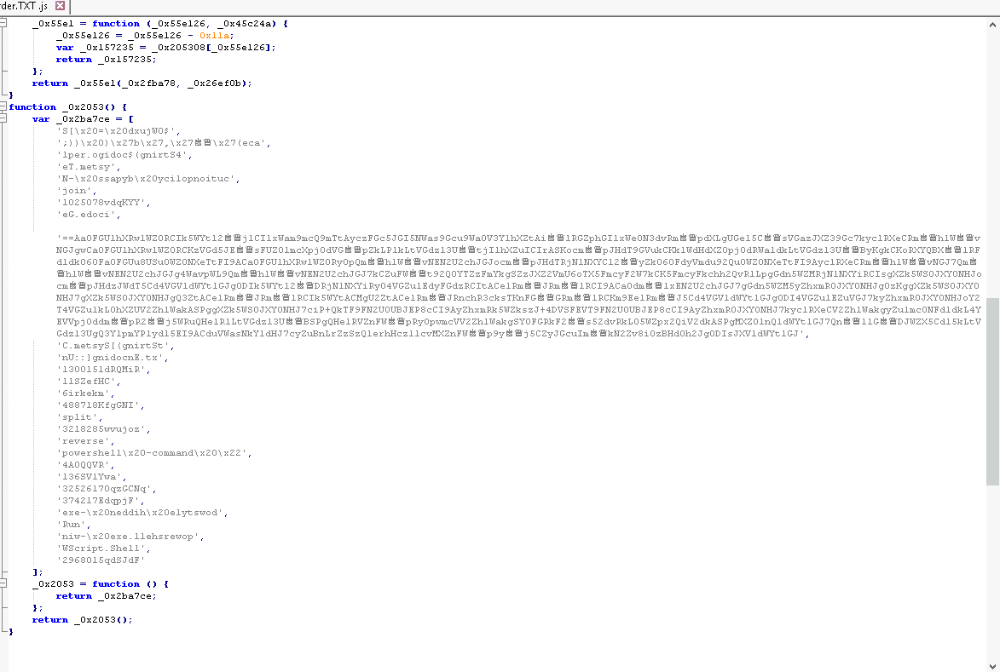
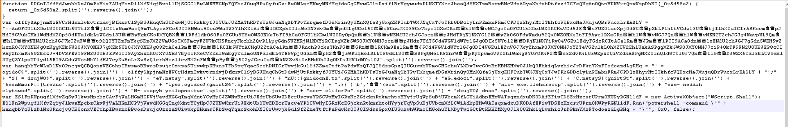
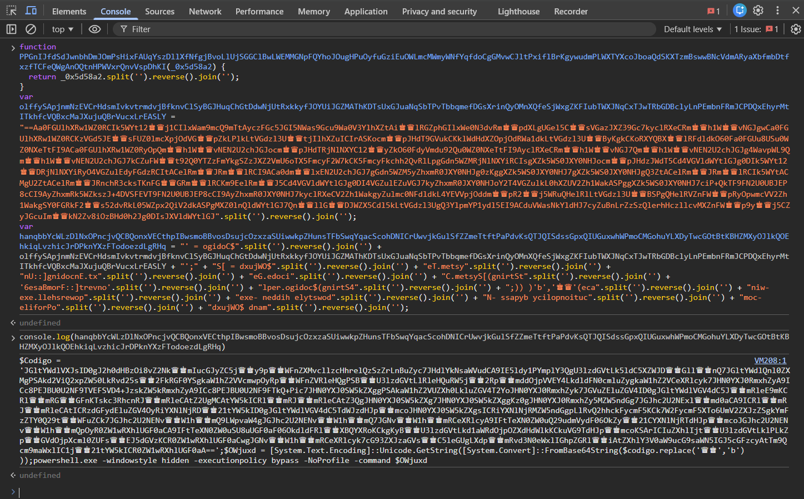
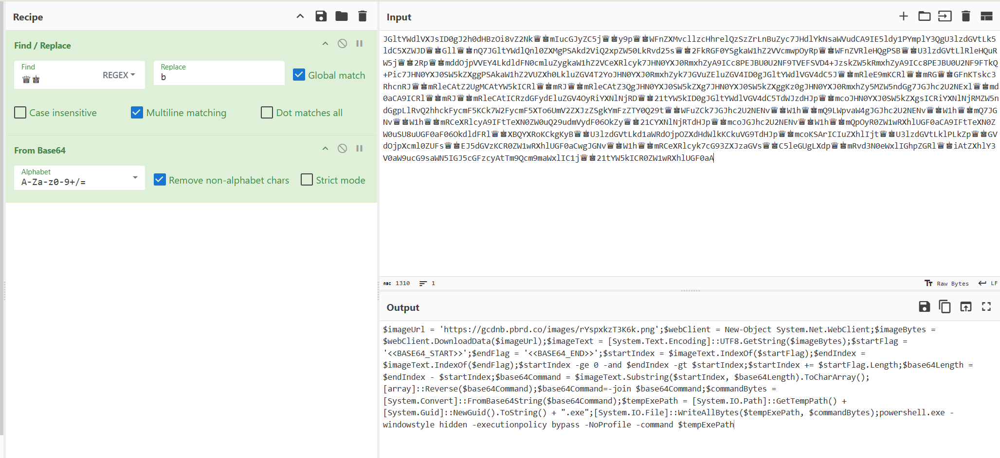
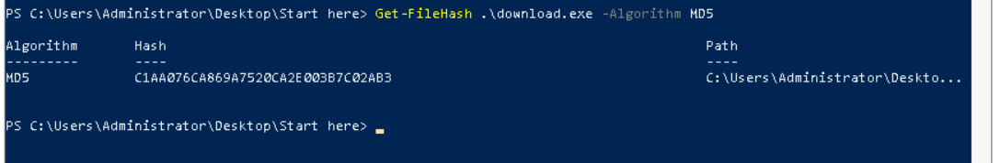
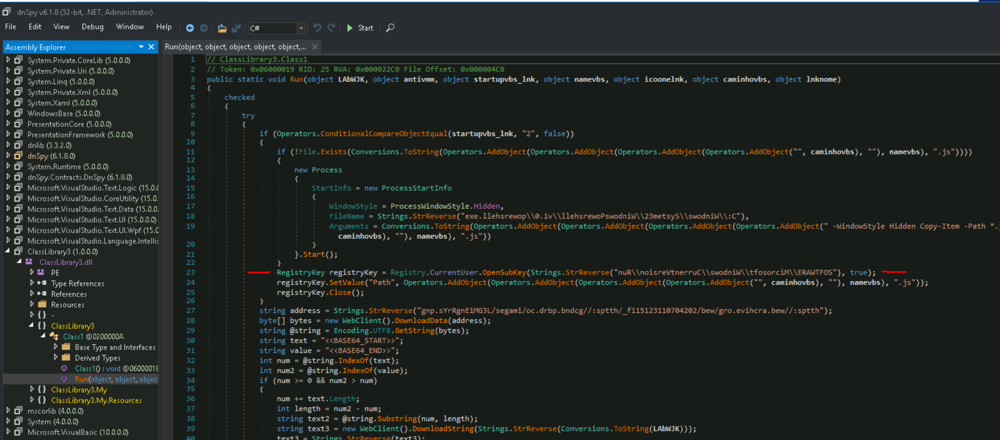
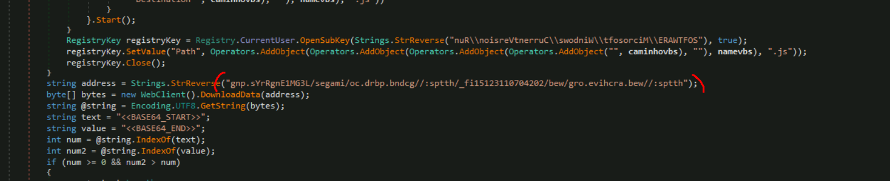
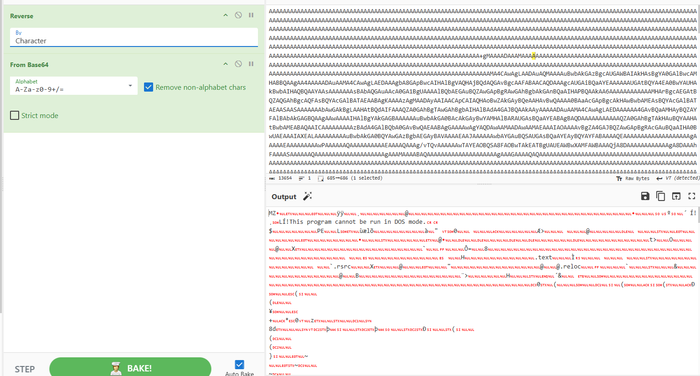

AsyncRAT
Challenge Information
Platform: CyberDefenders
Difficulty: Medium
Category: Malware Analysis
Scenario: You are a cybersecurity analyst at Globex Corp. A concerning report has come in: an employee opened an email with an attachment claiming to be an order specification, which actually harbored a JavaScript file designed to deploy AsyncRAT. This malware evades detection with alarming efficiency. To secure Globex's network and data, you must analyze the attachment, reverse-engineer the AsyncRAT’s obfuscation techniques, and determine the scope of AsyncRAT's infiltration.

## Tools Used

- [obf-io.deobfuscate.io](https://obf-io.deobfuscate.io/)
- [Cyberchef](https://gchq.github.io/CyberChef/)
- DnSpy

## Investigation Methodology

### Question 1: In the process of dissecting the AsyncRAT payload, you discover a variable in the PowerShell script shrouded in complexity. What is the name of this variable that conceals the malicious obfuscated code?

First we need to open the code and analyse how it looks.

We need to deobfuscate to see a bit better how things looks 

i use the chrome console (just not the last variable because of the error) and using the console.log(script) i get the deobfuscated command to get the answer.

**Answer:** `Codigo`

---

### Question 2: As you trace the AsyncRAT’s steps, you come across a pivotal moment where it reaches out to the internet, fetching the next phase of its invasion. Identify the URL used to download the second stage of this malicious campaign.

With the result of the chrome console i put the content of the codigo into cyberchief but we replace the the queen and king by a b character to get the information we need and we can see the URL used as answer.

**Answer:** `https://gcdnb.pbrd.co/images/rYspxkzT3K6k.png`

---

### Question 3: Within the chaos of encoded data retrieved during your investigation, there's a string that signals the beginning of the encoded code. What is this marker indicating where the encoded treasure lies within the downloaded file?

staying on the same page i can see the answer to the 3rd question which is the startFlag.

**Answer:** `<<BASE64_START>>`

---

### Question 4: The second stage of AsyncRAT has been meticulously unpacked, revealing an extracted Portable Executable (PE). To understand this stage's uniqueness, what is the MD5 hash of this extracted PE?

We open the image found previously on our notepad++ (or vsStudio) and we go to the part where we have the string with answer 3 and we copy paste it in our cyberchief with a base64 decoder to see we got a PE where we can download and analyse it

Just open a powershell to get the answer for the MD5 hash

**Answer:** `C1AA076CA869A7520CA2E003B7C02AB3`

---

### Question 5: AsyncRAT seeks to embed itself within the system for long-term espionage. During your sweep, you stumble upon a registry key intended for persistence. Can you provide the full path of this registry key where the malware attempts to solidify its presence?

For this one we use the dnSpy where we put our payload to analyse it, in the classLibrary3 and Run() we analyse it and found a part for the registryKey with the path for it, its in reverse so we use again cyberchief just with a reverse function to get the answer.

**Answer:** `HKCU\Software\Microsoft\Windows\CurrentVersion\Run`

---

### Question 6: Your analysis doesn't stop at the second stage; the malware has more secrets to unveil. A third stage is downloaded from a URL you need to uncover. What is the URL from which the malware downloads the third stage?

Scrolling a bit down we get a string that caught our attention, the StrReverse one where we can see a url in it (https in reverse who gave the hint), same thing for previous question we just reverse it to get the right URL

**Answer:** `https://web.archive.org/web/20240701132151if_/https://gcdnb.pbrd.co/images/L3GM1EngRrYs.png`

---

### Question 7: With the third stage of AsyncRAT now in focus, another Portable Executable (PE) comes to light. For a comprehensive understanding of this stage, what is the MD5 hash of the extracted PE from the third stage?

Like for the previous one we download the image on the link and get the code between the start and end of base64 and we put it in cyberchief (with the reverse function first before) to get the PE we need

And after we use the powershell command to get the MD5 hash

**Answer:** `3C63488040BB51090F2287418B3D157D`

## Lessons Learned

- Analyse a obfuscate malware and what tool to use

## References

- [[Link to challenge]](https://cyberdefenders.org/blueteam-ctf-challenges/asyncrat/)

---

**Completion Date**: 21/01/2026 
**Time Spent**: 2 hours
